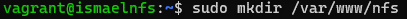
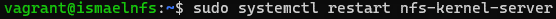

#   Índice
[1.	Configuración VagrantFile y scripts de aprovisionamiento.	](#1)

[1.1.	Configuración VagrantFile.	](#11)

[1.2.	Scripts de aprovisionamiento.	](#12)

[1.2.1.	Script máquina Balanceador.	](#121)

[1.2.2.	Script máquinas Nginx.	](#122)

[1.2.3.	Script máquina NFS.	](#123)

[1.2.4.	Script máquina MySQL.	](#124)

[2.	Configuración máquina MySQL.	](#2)

[3.	Configuración máquinas NFS y Nginx.	](#3)

[4.	Configuración Balanceador.	](#4)

[4.1. Modo no seguro.](#41)

[4.2. Modo seguro.](#42)

#   1. Configuración VagrantFile y scripts de aprovisionamiento. 

## 1.1. Configuración VagrantFile. 

Crearemos 5 máquinas, una que actuará como balanceador, 2 que tendrán el servicio nginx, una máquina que será un servidor nfs para actualizar ambas nginx y una que será un servidor MySQL. 

## 1.2. Scripts de aprovisionamiento.

Habrá que crear un script por cada tipo de máquina que queramos crear, estos serán los siguientes.

### 1.2.1. Script máquina Balanceador.

### 1.2.2. Script máquinas Nginx. 

### 1.2.3. Script máquina NFS. 

### 1.2.4. Script máquina MySQL. 

# 2. Configuración máquina MySQL.

Lo primero que hay que hacer es entrar en el directorio **/etc/mysql/mariadb.conf.d** y ahí modificar el fichero **50-server.cnf**.

En este fichero cambiaremos la **bind-address** y pondremos la ip de nuestra maquina sql.

Después de esto, tendremos que asignar una contraseña al root de MySQL para poder acceder con el posteriormente. Esto lo haremos con el comando **sudo mysql\_secure\_installation**, este comando nos mostrará una sucesión de preguntas para la configuración a las que responderemos que sí. Al principio pedirá contraseña pero al no tener ninguna, pulsaremos enter y podremos continuar. Justo seguido de la primera pregunta, nos dará la opción para cambiar la contraseña.

Ahora entraremos a MySQL como usuario root y crearemos un usuario normal con la IP de la máquina Nginx (al haber más de una máquina, pondremos un % para que haga referencia a todas). A este usuario le daremos todos los permisos dentro de la base de datos que posteriormente agregaremos.

En el home de esta máquina clonaremos el repositorio de git que usaremos para descargar nuestra base de datos.

Ahora importaremos el fichero **database.sql** que hay en la ruta carpeta db del directorio que se nos creó al clonar el repositorio a nuestro MySQL.

# 3. Configuración máquinas Nginx y servidor NFS.

Lo primero de todo será crear una carpeta en cada directorio **/var/www** de las 3 máquinas y montarlas para que con descargar algo en la de la máquina NFS lo tengamos también en las máquinas Nginx.

Para montarlas primero tendremos que configurar el fichero **/etc/exports** con las rutas de las carpetas de las máquinas Nginx y las IPs de esas máquinas.

Una vez hecho esto, tendremos que reiniciar el servicio NFS y podremos montar las carpetas de las máquinas Nginx.

Con esto, todo lo que hagamos en la carpeta del servidor NFS, se hará también en las carpetas de las máquinas Nginx. Por lo que ahora clonaremos el repositorio de git en la carpeta de la máquina NFS y haremos todas las configuraciones en esta máquina.

Una vez clonado el repositorio, moveremos todo el contenido del subdirectorio src hacia la carpeta que hemos creado en /var/www.

Ahora editaremos el fichero config.php y en este cambiaremos el valor de DB_HOST por la IP de la máquina SQL.

Una vez hecho esto, hay que ir a la ruta **/etc/php/7.4/fpm/pool.d** y configuramos el fichero **www.conf** para poder conectarnos por socket TCP/IP. Aquí cambiaremos el contenido de la línea listen por la dirección 0.0.0.0 y el puerto 9000.

Ahora nos iremos a las máquinas Nginx y en **/etc/nginx/sites-enabled** editamos el archivo default. En este pondremos la ruta de nuestra carpeta nfs de **/var/www** y bajaremos y agregaremos index.php al lado de index.html. Seguiremos bajando y habrá unas líneas que empiezan por location y estarán comentadas, las descomentaremos, pero en la que pone \\.php dejaremos comentada la de unix ya que es un socket que no necesitamos. En la otra línea de fatscgi_pass pondremos la IP de nuestro servidor NFS y el puerto 9000.

# 4. Configuración Balanceador.

## 4.1. Modo no seguro.

Primero haremos una configuración HTTP para comprobar que funcione correctamente, para ello iremos a **/etc/nginx/sites-available** y crearemos un fichero de configuración al que le pondremos las siguientes líneas.

Una vez hecho esto le haremos un enlace hacia sites-enabled y borraremos el default que hay ahí. Ya para terminar reiniciamos el servicio Nginx y comprobamos que funcione correctamente.

## 4.2. Modo seguro.

Para configurarlo en modo seguro, lo primero será generar unas claves certificadoras, ya que son necesarias para activar SSL en Nginx. Para ello usaremos el siguiente comando.

    sudo openssl req -x509 -nodes -days 365 -newkey rsa:2048 -keyout /etc/ssl/private/servernginx.com.key -out /etc/ssl/certs/servernginx.com.pem

Con esto crearemos tanto un certificado público como una clave privada.

Ahora tendremos que irnos a nuestro fichero de configuración de Nginx que esta en **sites-enabled** y agregar las líneas necesarias para que funcione el SSL. También podremos documentar las líneas que agregamos anteriormente si queremos que a nuestra página solo se pueda acceder desde HTTPS.

Ya solo nos queda reiniciar nuestro servicio Nginx y al intentar acceder desde internet solo podremos poniendo https:// seguido de la dirección IP pública.

